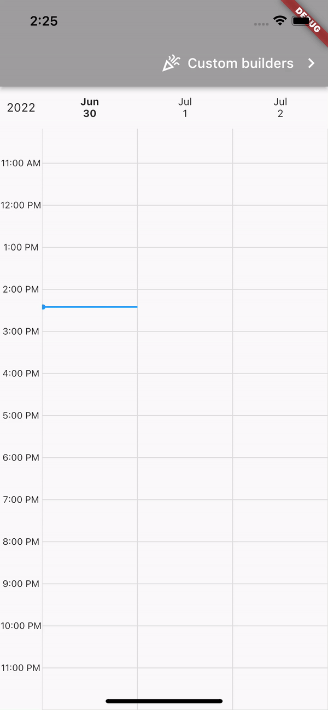

# Timetable for Flutter

This package is a timetable for Flutter.




```dart
import 'dart:math';

import 'package:flutter/material.dart';
import 'package:flutter_timetable/flutter_timetable.dart';
import 'package:intl/intl.dart';

void main() {
  runApp(const MyApp());
}

class MyApp extends StatelessWidget {
  const MyApp({Key? key}) : super(key: key);
  @override
  Widget build(BuildContext context) => MaterialApp(
        routes: {
          '/': (context) => const TimetableScreen(),
          '/custom': (context) => const CustomizedTimetableScreen(),
        },
      );
}

/// Plain old default time table screen.
class TimetableScreen extends StatelessWidget {
  const TimetableScreen({Key? key}) : super(key: key);
  @override
  Widget build(BuildContext context) => Scaffold(
        appBar: AppBar(
          backgroundColor: Colors.grey,
          actions: [
            TextButton(
              onPressed: () async => Navigator.pushNamed(context, '/custom'),
              child: Row(
                mainAxisSize: MainAxisSize.max,
                children: const [
                  Icon(Icons.celebration_outlined, color: Colors.white),
                  SizedBox(width: 8),
                  Text("Custom builders", style: TextStyle(color: Colors.white, fontSize: 16)),
                  SizedBox(width: 8),
                  Icon(Icons.chevron_right_outlined, color: Colors.white),
                ],
              ),
            ),
          ],
        ),
        body: const Timetable(),
      );
}

/// Timetable screen with all the stuff - controller, builders, etc.
class CustomizedTimetableScreen extends StatefulWidget {
  const CustomizedTimetableScreen({Key? key}) : super(key: key);
  @override
  State<CustomizedTimetableScreen> createState() => _CustomizedTimetableScreenState();
}

class _CustomizedTimetableScreenState extends State<CustomizedTimetableScreen> {
  final items = generateItems();
  final controller = TimetableController(
    start: DateUtils.dateOnly(DateTime.now()).subtract(const Duration(days: 7)),
    initialColumns: 3,
    cellHeight: 100.0,
  );

  @override
  void initState() {
    super.initState();
    WidgetsBinding.instance.addPostFrameCallback((_) async {
      Future.delayed(const Duration(milliseconds: 100), () {
        controller.jumpTo(DateTime.now());
      });
    });
  }

  @override
  Widget build(BuildContext context) => Scaffold(
        appBar: AppBar(
          backgroundColor: Colors.grey,
          actions: [
            TextButton(
              onPressed: () async => Navigator.pop(context),
              child: Row(
                children: const [
                  Icon(Icons.chevron_left_outlined, color: Colors.white),
                  SizedBox(width: 8),
                  Text("Default", style: TextStyle(color: Colors.white, fontSize: 16)),
                ],
              ),
            ),
            const Spacer(),
            IconButton(
              icon: const Icon(Icons.calendar_view_day),
              onPressed: () => controller.setColumns(1),
            ),
            IconButton(
              icon: const Icon(Icons.calendar_view_month_outlined),
              onPressed: () => controller.setColumns(3),
            ),
            IconButton(
              icon: const Icon(Icons.calendar_view_week),
              onPressed: () => controller.setColumns(5),
            ),
            IconButton(
              icon: const Icon(Icons.zoom_in),
              onPressed: () => controller.setCellHeight(controller.cellHeight + 10),
            ),
            IconButton(
              icon: const Icon(Icons.zoom_out),
              onPressed: () => controller.setCellHeight(controller.cellHeight - 10),
            ),
          ],
        ),
        body: Timetable<String>(
          controller: controller,
          items: items,
          cellBuilder: (datetime) => Container(
            decoration: BoxDecoration(
              border: Border.all(color: Colors.blueGrey, width: 0.2),
            ),
            child: Center(
              child: Text(
                DateFormat("MM/d/yyyy\nha").format(datetime),
                style: TextStyle(
                  color: Color(0xff000000 + (0x002222 * datetime.hour) + (0x110000 * datetime.day)).withOpacity(0.5),
                ),
                textAlign: TextAlign.center,
              ),
            ),
          ),
          cornerBuilder: (datetime) => Container(
            color: Colors.accents[datetime.day % Colors.accents.length],
            child: Center(child: Text("${datetime.year}")),
          ),
          headerCellBuilder: (datetime) {
            final color = Colors.primaries[datetime.day % Colors.accents.length];
            return Container(
              decoration: BoxDecoration(
                border: Border(bottom: BorderSide(color: color, width: 2)),
              ),
              child: Center(
                child: Text(
                  DateFormat("E\nMMM d").format(datetime),
                  style: TextStyle(
                    color: color,
                  ),
                  textAlign: TextAlign.center,
                ),
              ),
            );
          },
          hourLabelBuilder: (time) {
            final hour = time.hour == 12 ? 12 : time.hour % 12;
            final period = time.hour < 12 ? "am" : "pm";
            final isCurrentHour = time.hour == DateTime.now().hour;
            return Text(
              "$hour$period",
              style: TextStyle(
                fontSize: 14,
                fontWeight: isCurrentHour ? FontWeight.bold : FontWeight.normal,
              ),
            );
          },
          itemBuilder: (item) => Container(
            decoration: BoxDecoration(
              color: Colors.white.withAlpha(220),
              borderRadius: BorderRadius.circular(16),
              boxShadow: [
                BoxShadow(color: Colors.black.withOpacity(0.2), blurRadius: 4, offset: Offset(0, 2)),
              ],
            ),
            child: Center(
              child: Text(
                item.data ?? "",
                style: TextStyle(fontSize: 14),
              ),
            ),
          ),
          nowIndicatorColor: Colors.red,
          snapToDay: true,
        ),
        floatingActionButton: FloatingActionButton(
          child: const Text("Now"),
          onPressed: () => controller.jumpTo(DateTime.now()),
        ),
      );
}

/// Generates some random items for the timetable.
List<TimetableItem<String>> generateItems() {
  final random = Random();
  final items = <TimetableItem<String>>[];
  final today = DateUtils.dateOnly(DateTime.now());
  for (var i = 0; i < 100; i++) {
    int hourOffset = random.nextInt(56 * 24) - (7 * 24);
    final date = today.add(Duration(hours: hourOffset));
    items.add(TimetableItem(
      date,
      date.add(Duration(minutes: (random.nextInt(8) * 15) + 15)),
      data: "item $i",
    ));
  }
  return items;
}

```

## Additional information

TODO: Tell users more about the package: where to find more information, how to 
contribute to the package, how to file issues, what response they can expect 
from the package authors, and more.


